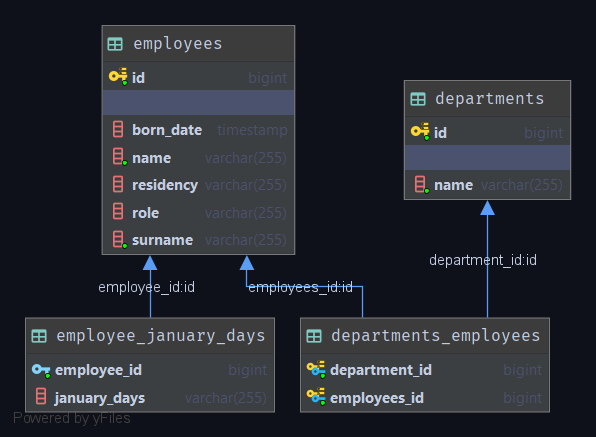

# Тестовое задание: табель - учёт времени
## 1. Спроектировать БД учёта рабочего времени - табель

Выполнял задание: _Кульбако Артемий_

Департамент - содержит имя и множество уникальных сущностей сотрудников:

```
@Entity @Table(name = "departments")
public class Department implements Serializable {

    @Transient private static final long serialVersionUID = 4L;
    @Id @GeneratedValue(strategy=GenerationType.AUTO) long id;
    @NotNull private String name;
    @OneToMany private Set<Employee> employees;

    //getters, setters and etc.
}
```  

Сотрудник имеет имя, фамилию, дату рождения место жительства, сущность рабочего календаря, и должность в компании:

```
@Entity @Table(name = "employees")
public class Employee implements Serializable {

    @Transient private static final long serialVersionUID = 4L;
    @Id @GeneratedValue(strategy=GenerationType.AUTO) long id;
    @NotNull private String name;
    @NotNull private String surname;
    @JsonFormat(pattern="yyyy-MM-dd") private Date bornDate;
    private String residency;
    @Embedded private WorkingCalendar calendar;
    @Enumerated(EnumType.STRING) private Role role;

    //getters, setters and etc.
} 
```

Должность в кампании представляет собой класс-перечисление профессий, а также содержит информацию о том, работает ли сотрудник удалённо:

```
public enum Role {
    EMPTY(false),
    TIMEKEEPER(false),
    DEPARTMENT_ADMIN(false),
    EMPLOYEE_ADMIN(false);

    private boolean isRemote;

    //getters, setters and etc.
}
```

Рабочий календарь содержит коллекции отметок, для каждого месяца года отдельно, т.к. jpa не поддерживает вложенные коллекции:
```
@Embeddable @Table(name = "days")
public class WorkingCalendar implements Serializable {

    @Transient private static final long serialVersionUID = 4L;
    //jpa не поддерживает вложенные коллекции, поэтому будем костылить
    @Enumerated(EnumType.STRING) @ElementCollection private List<WorkDayCode> januaryDays;
    @Enumerated(EnumType.STRING) @ElementCollection private List<WorkDayCode> februaryDays;
    @Enumerated(EnumType.STRING) @ElementCollection private List<WorkDayCode> marchDays;
    @Enumerated(EnumType.STRING) @ElementCollection private List<WorkDayCode> aprilDays;
    @Enumerated(EnumType.STRING) @ElementCollection private List<WorkDayCode> mayDays;
    @Enumerated(EnumType.STRING) @ElementCollection private List<WorkDayCode> juneDays;
    @Enumerated(EnumType.STRING) @ElementCollection private List<WorkDayCode> julyDays;
    @Enumerated(EnumType.STRING) @ElementCollection private List<WorkDayCode> augustDays;
    @Enumerated(EnumType.STRING) @ElementCollection private List<WorkDayCode> septemberDays;
    @Enumerated(EnumType.STRING) @ElementCollection private List<WorkDayCode> octoberDays;
    @Enumerated(EnumType.STRING) @ElementCollection private List<WorkDayCode> novemberDays;
    @Enumerated(EnumType.STRING) @ElementCollection private List<WorkDayCode> decemberDays;

    //getters, setters and etc.
}
```
Отметки дней также являются перечислением:
```
public enum WorkDayCode {
    FULL_DAY {//полный рабочий день
        @Override public String toString() { return "Я"; }
        },
    UNKNOWN_LACK {//отсутствие на рабочее место по невыясненным причинам
        @Override public String toString() { return "Н"; }
        },
    WEEKEND {//выходные и праздничные дни
        @Override public String toString() { return "В"; }
        },
    WEEKEND_WORK {//работа в праздничные и выходные дни; а также работа в праздничные и выходные дни, при нахождении в командировке
        @Override public String toString() { return "Рв"; }
    },
    TEMP_INOPERABILITY {//дни временной нетрудоспособности
        @Override public String toString() { return "Б"; }
    },
    BUSSINESS_TRIP {
        /*
        командировочные дни; а также, выходные (нерабочие) дни при нахождении в командировке,
        когда сотрудник отдыхает, в соответствии с графиком работы ООО «Наука» в командировке
         */
        @Override public String toString() { return "К"; }
    },
    PAID_HOLIDAY {//ежегодный основной оплаченный отпуск
        @Override public String toString() { return "ОТ"; }
    },
    UNPAID_HOLIDAY {//неоплачиваемый отпуск
        @Override public String toString() { return "До"; }
    },
    BUSINESS_DAY {//хозяйственный день
        @Override public String toString() { return "Хд"; }
    },
    STUDY_HOLIDAY {//отпуск на период обучения
        @Override public String toString() { return "У"; }
    },
    MATERNITY_LEAVE {//Отпуск по уходу за ребенком
        @Override public String toString() { return "Ож"; }
    }
}
```

Итоговая схема в терминах реляционной модели данных будет выглядеть так:


Здесь для наглядности не показаны таблицы для месяцев февраль-декабрь ```(employee_february_days - employee_december_days)```.

## 2. Разработать ПО с пользовательским интерфейсом для просмотра учёта времени

**Backend**

Стек технологий: ```Java 8 + Spring Boot```

Представляет собой REST-сервис обменивающийся данным с клиентами в Json.
Для запуска backend-слоя необходимо сконфигурировать рабочую БД согласно следующим параметрам:

    url=jdbc:postgresql://localhost:5432/scentia
    username=postgres
    password=root

И освободить порт ```8088``` для приложения. Создавать таблицы в БД не нужно, программа сделает это автоматически при добавлении данных.

**Frontend**

Стек технологий: ```Kolin + JavaFX```

Является тонким клиентом, обращающимся не к БД напрямую, а к серверу для манипулирования информацией.

Исполняемые jar-файлы находятся в директории ```out/artifacts```.